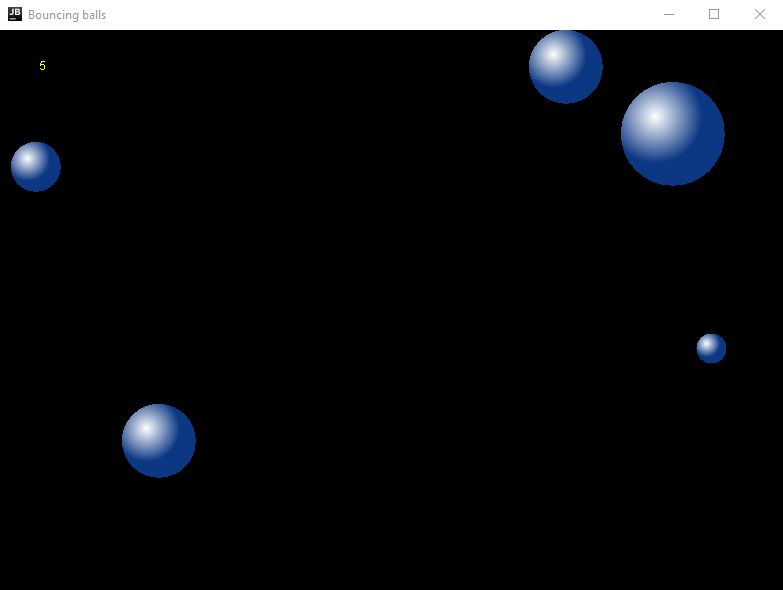
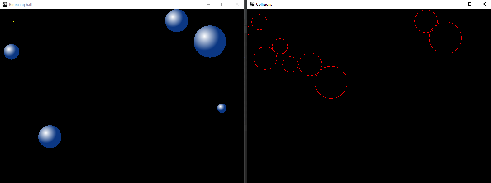

# Bouncing Balls

The program allows you to open two windows.
The first window opens automatically after starting the program. 
When you left-click in the window, a ball will appear in the indicated place, and it will start moving in a random direction.
With scroll, we can increase or decrease the size of new balls. 
Balls bounce off walls and off each other
A sound is played when there is a collision.
The position of each collision is saved in the file "collisions.txt".

When we move the cursor outside the area of the first window, the second window will automatically open in which each collision saved in the "collisions.txt" file will be displayed and the ball movement in the first window will be stopped.
To close this window and restart the ball movement, return the cursor to the first window.

### Features
* Multithreaded
* The size of the ball can be modified using scroll
* Ball counter in the upper left corner
* Balls bounce off walls and off each other
* 3D look using fade
* Sound during a collision
* Saving collision coordinates in a file
* When the cursor moves outside the main window, a second window 
opens in which the ball collision positions are displayed
